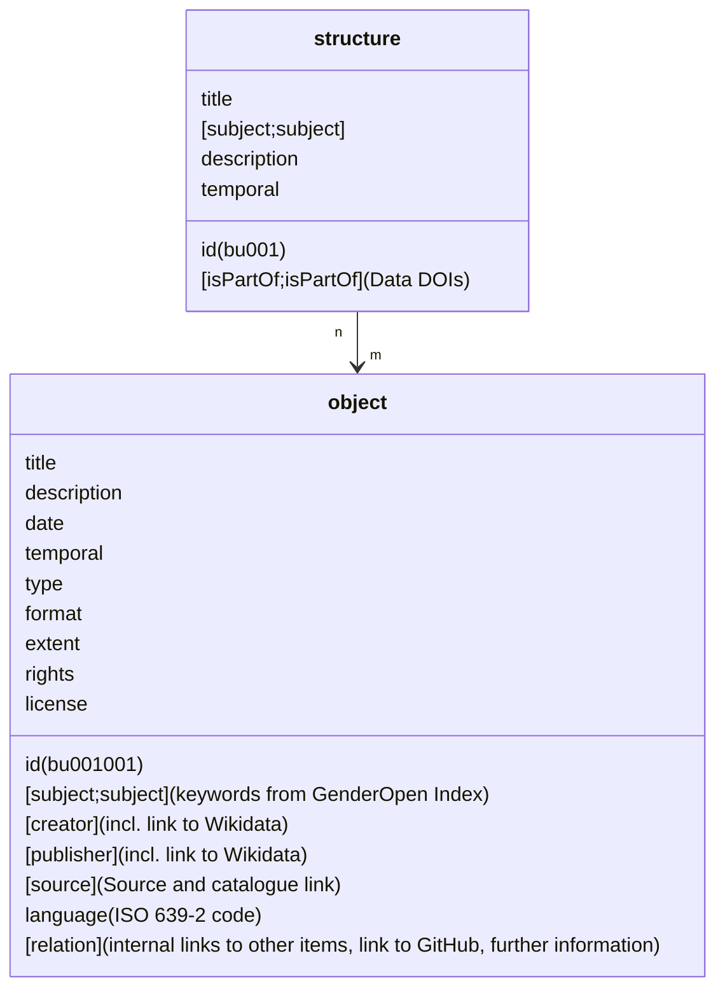

# maxvogt

The open-source code of the digital collection for research data on railway infrastructure designed by Swiss architect Max Vogt.

[](https://github.com/mtwente/maxvogt/issues)
[](https://github.com/mtwente/maxvogt/network)
[](https://github.com/mtwente/maxvogt/stargazers)
[](https://www.zotero.org/groups/5400359/sbb-max-vogt/library)
[](https://github.com/mtwente/maxvogt/blob/main/LICENSE)

## Overview

Welcome to the *maxvogt* collection repository, a 2024 research project by [Moritz Twente](https://mtwente.github.io/maxvogt-analysis/docs/about.html#people) (University of Basel) and [Luisa Omonsky](https://mtwente.github.io/maxvogt-analysis/docs/about.html#people) (Vienna University of Technology). The authors analyse buildings and other built structures designed by SBB architect Max Vogt from an urban design perspective, taking into account the buildings’ placements in the built environment. In addition to this spatio-morphological analysis, another result of the project is an extensive survey of more than a hundred built structures that were designed by and/or under the supervision of Max Vogt during his time at SBB’s Zurich construction division. Combining different catalogues of works and linking additional sources to them, the authors present a novel online database built SBB heritage.

This project repository is the open-source code of the digital platform for research data output of the maxvogt project. It is a static website built with [CollectionBuilder-CSV](https://collectionbuilder.github.io/) and hosted on [GitHub Pages](https://pages.github.com/). Data created for this project by the authors is mainly hosted at [Wikimedia Commons](https://commons.wikimedia.org/wiki/Category:Max_Vogt), with additional geodata and python scripts available on [GitHub](https://mtwente.github.io/maxvogt-analysis/). 

## Key Features

- **Fast Static Website**: Built with CollectionBuilder-CSV using open source static site generator [Jekyll](https://jekyllrb.com/) and a modern static web stack.
- **Explorative Access to Metadata**: Interactive features for exploring collection metadata such as maps, a timeline, filtering and comprehensive annotation.
- **Integration of External Resources**: Collection items include photographic records and maps produced by Moritz Twente and Luisa Omonsky. Additionally, records from the archives of [SBB Historic](https://www.sbbhistoric.ch/sammlungen-archive), from Wikimedia Commons and other available sources are integrated where feasible. Bibliographic information is available for all objects via linking to a [Zotero group library](https://www.zotero.org/groups/5400359/sbb-max-vogt/library).
- **Accessibility-Focused Design**: Ensuring inclusivity for all users by complying with WCAG standards and observing neurodiversity design guidelines. <!-- More at our [accessibility statement](https://stadtgeschichtebasel.ch/barrierefreiheitserklaerung/). -->

### CollectionBuilder

The technical basis for this research data platform is provided by [CollectionBuilder](https://collectionbuilder.github.io/), an open source framework for creating metadata-driven digital collections. CollectionBuilder is a project maintained by the University of Idaho Library's [Digital Initiatives](https://www.lib.uidaho.edu/digital/) and the [Center for Digital Inquiry and Learning](https://cdil.lib.uidaho.edu) (CDIL) following the [Lib-Static](https://lib-static.github.io/) methodology.

The basic theme is created using [Bootstrap](https://getbootstrap.com/), tweaked by the authors using the [SBB colour palette](https://digital.sbb.ch/en/foundation/colors/base-colors/).
Metadata visualizations are built using open source libraries such as [DataTables](https://datatables.net/), [Spotlight gallery](https://github.com/nextapps-de/spotlight), [lazysizes](https://github.com/aFarkas/lazysizes), [Lunr.js](https://lunrjs.com/) and [Leaflet](https://leafletjs.com/).
Object metadata is exposed using [Schema.org](http://schema.org) and [Open Graph protocol](http://ogp.me/) standards.

For more information on CollectionBuilder, visit the [Docs](https://collectionbuilder.github.io/cb-docs/).

## Data Model

Metadata for items featured in this project is provided according to a data model developed by the authors.

The following chart illustrates the data model with metadata fields for a sample metadata object `bu001` that has one child media object `bu001001`. If a metadata object has more than one child media object, the children `id`s are numbered consecutively: `bu001001`, `bu001002` etc.



## Installation

Use [Bundle](https://bundler.io/) to install all dependencies.

```bash
bundle install
```

## Usage

Run the development server.

```bash
bundle exec jekyll serve
```

Build for production.

```bash
rake deploy
```

## Support

This project is maintained by [@mtwente](https://github.com/mtwente). Please understand that we won't be able to provide individual support via email. We believe that help is much more valuable if it's shared publicly, so that more people can benefit from it.

| Type                                   | Platforms                                                                                                     |
| -------------------------------------- | ------------------------------------------------------------------------------------------------------------- |
| 🚨 **Bug Reports**                     | [GitHub Issue Tracker](https://github.com/mtwente/maxvogt/issues)    |
| 🎁 **Feature Requests**                | [GitHub Issue Tracker](https://github.com/mtwente/maxvogt/issues)    |
| 🛡 **Report a security vulnerability** | [GitHub Issue Tracker](https://github.com/mtwente/maxvogt/issues)    |
| 💬 **General Questions**               | [GitHub Discussions](https://github.com/mtwente/maxvogt/discussions) |

## Contributing

Please read [CONTRIBUTING.md](CONTRIBUTING.md) for details on our code of conduct, and the process for submitting pull requests to us.

## Versioning

We use [SemVer](http://semver.org/) for versioning. For the versions available, see the [tags on this repository](https://github.com/mtwente/maxvogt/tags).

## Authors and acknowledgment

- **Moritz Twente** - [mtwente](https://github.com/mtwente)
– **Luisa Omonsky** – [omonsgit](https://github.com/omonsgit)

[CollectionBuilder](https://collectionbuilder.github.io/) is developed by Peter Williamson, Devin Becker and Olivia Wikle. This CollectionBuilder instance makes use of some features developed at [Stadt.Geschichte.Basel](https://github.com/Stadt-Geschichte-Basel/forschung.stadtgeschichtebasel.ch) by [Moritz Mähr](https://github.com/maehr), [Nico Görlich](https://github.com/koilebeit) and [Moritz Twente](https://github.com/mtwente).

See also the list of [contributors](https://github.com/mtwente/maxvogt/graphs/contributors) who participated in this project.

---

## License

The code in this repository is licensed under the [MIT](https://github.com/mtwente/maxvogt/blob/main/LICENSE) license. This license does not include external dependencies included in the `assets/lib` directory, which are covered by their individual licenses.

Any content relating to the items that form the research data collection (e.g. media files, metadata objects) at [mtwente.github.io/maxvogt-analysis](https://mtwente.github.io/maxvogt-analysis) are _NOT_ covered by this license. Please see the individual rights and license statement in the corresponding metadata for each collection item.